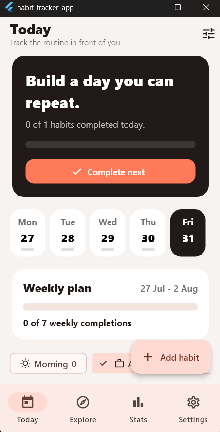
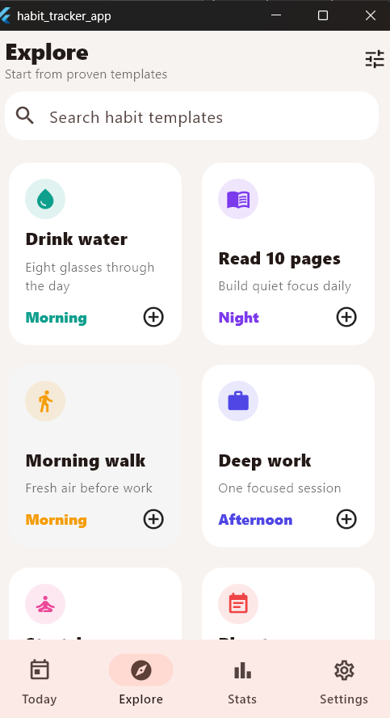
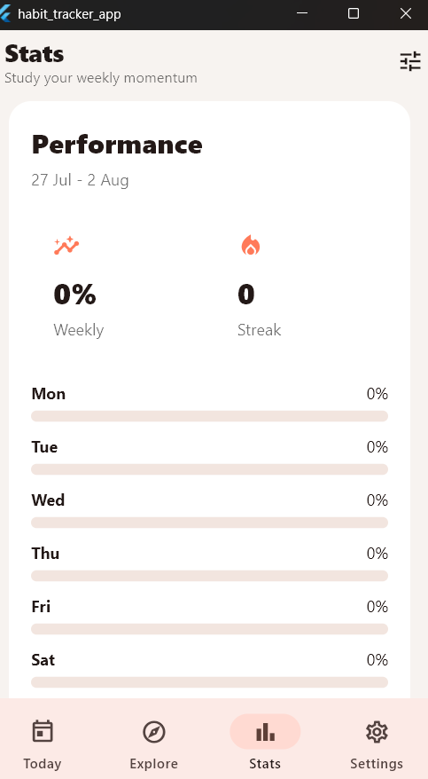
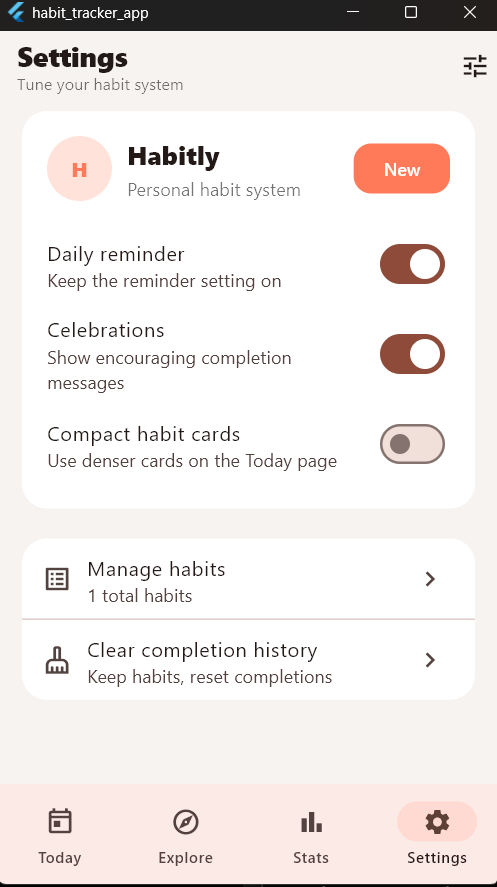

# 📅 Habit Tracker App

<p align="center">
  <b>Build Better Habits. Stay Consistent. Achieve Your Goals.</b>
</p>

<p align="center">
A modern and intuitive Habit Tracker application built with <b>Flutter</b> to help users develop positive habits, monitor daily progress, and stay motivated through consistency.
</p>

---

## ✨ Features

- ✅ Create and manage daily habits
- ✏️ Edit existing habits anytime
- 🗑️ Delete habits with ease
- 📅 Mark habits as completed each day
- 📊 Track your progress visually
- 📈 Build consistency with daily tracking
- 🎨 Clean, modern, and responsive UI
- ⚡ Fast and lightweight performance
- 📱 Cross-platform support (Android, iOS, Windows, Linux, macOS & Web)

---

## 📸 Screenshots

| Today | Explore |
|:------:|:-------:|
|  |  |

| Statistics | Settings |
|:----------:|:--------:|
|  |  |

---

## 🛠️ Tech Stack

| Technology | Description |
|------------|-------------|
| Flutter | Cross-platform UI Framework |
| Dart | Programming Language |
| Material Design | User Interface Components |
| VS Code | Development Environment |
| Git | Version Control |
| GitHub | Source Code Hosting |

---

## 📂 Project Structure

```text
lib/
├── main.dart
├── screens/
├── widgets/
├── models/
├── services/
└── utils/
```

The project follows a clean and modular architecture, making the codebase easy to understand, maintain, and extend.

---

## 🚀 Installation

### Clone the repository

```bash
git clone https://github.com/IT-Abhishek01/habit-tracker-app.git
```

### Navigate to the project folder

```bash
cd habit-tracker-app
```

### Install dependencies

```bash
flutter pub get
```

### Run the application

```bash
flutter run
```

---

## 📋 Prerequisites

Before running the project, ensure you have:

- Flutter SDK
- Dart SDK
- Git
- Visual Studio Code or Android Studio
- A configured Flutter development environment

---

## 🎯 Future Improvements

- 🔐 User Authentication
- ☁️ Cloud Sync & Backup
- 🔔 Daily Habit Reminder Notifications
- 🌙 Dark Mode
- 📅 Calendar View
- 📊 Weekly & Monthly Analytics
- 🏆 Achievement & Reward System
- 📤 Export Progress Reports
- 🎨 Custom Themes
- 📈 Detailed Habit Statistics

---

## 🤝 Contributing

Contributions are welcome!

1. Fork this repository.
2. Create a new feature branch.

```bash
git checkout -b feature-name
```

3. Commit your changes.

```bash
git commit -m "Add your feature"
```

4. Push to GitHub.

```bash
git push origin feature-name
```

5. Open a Pull Request.

---

## 👨‍💻 Developer

**Abhishek**

Software Developer | Flutter Developer | Python Developer

**GitHub:**  
https://github.com/IT-Abhishek01

---

## ⭐ Support

If you found this project helpful or interesting, please consider giving it a **⭐ Star** on GitHub.

Your support helps motivate future improvements and more open-source projects.

---

## 📄 License

This project is licensed under the **MIT License**.

Feel free to use, modify, and learn from this project for personal or educational purposes.